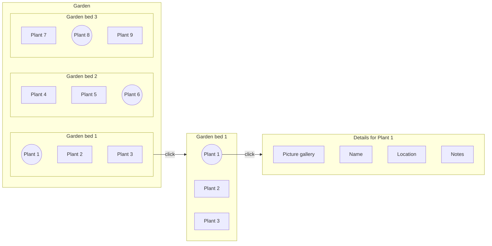

## Ideas

## 01 How a user would interact with his garden

```mermaid
flowchart LR
    subgraph garden_1["Garden"]
      subgraph garden_bed_1["Garden bed 1"]
          plant_1(("Plant 1"))
          plant_2["Plant 2"]
          plant_3["Plant 3"]
      end
      subgraph garden_bed_2["Garden bed 2"]
          plant_4["Plant 4"]
          plant_5["Plant 5"]
          plant_6(("Plant 6"))
      end
      subgraph garden_bed_3["Garden bed 3"]
          plant_7["Plant 7"]
          plant_8(("Plant 8"))
          plant_9["Plant 9"]
      end
    end
    
    subgraph single_garden_bed["Garden bed 1"]
        single_plant_1(("Plant 1"))
        single_plant_2["Plant 2"]
        single_plant_3["Plant 3"]
    end
    
    subgraph details["Details for Plant 1"]
        picture["Picture gallery"]
        desc["Name"]
        location["Location"]
        diary_notes["Notes"]
    end
    
    garden_bed_1 -- click --> single_garden_bed
    single_plant_1 -- click --> details
```