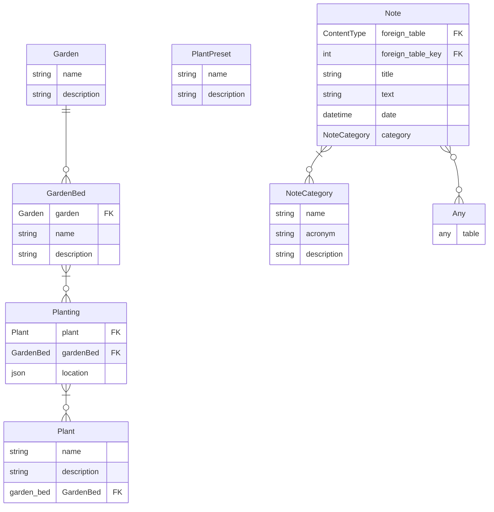

```mermaid
erDiagram
    Garden {
        string name
        string description
    }
    GardenBed {
        Garden garden FK
        string name
        string description
    }
    Plant {
        string name
        string description
        garden_bed GardenBed FK
    }
    Planting {
        Plant plant FK
        GardenBed gardenBed FK
        json location
    }
    PlantPreset {
        string name
        string description
    }
    
    Note {
        ContentType foreign_table FK
        int foreign_table_key FK
        string title
        string text
        datetime date
        NoteCategory category
    }
    
    NoteCategory {
        string name
        string acronym
        string description
    }
    
    Any {
        any table
    }

    Garden ||--o{ GardenBed: ""
    GardenBed }|--o{ Planting: ""
    Planting }|--o{ Plant: ""
    
    Note }|--o{ NoteCategory: ""
    Note }o--o{ Any: ""
```