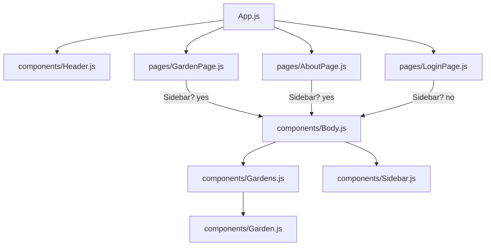

```mermaid
flowchart

App["App.js"]

Head["components/Header.js"]
Body["components/Body.js"]
Gardens["components/Gardens.js"]
Sidebar["components/Sidebar.js"]
Garden["components/Garden.js"]

GardenPage["pages/GardenPage.js"]
AboutPage["pages/AboutPage.js"]
LoginPage["pages/LoginPage.js"]

App --> Head
App --> GardenPage
App --> AboutPage
App --> LoginPage

GardenPage -- Sidebar? yes --> Body --> Sidebar
Body --> Gardens
Gardens --> Garden

AboutPage -- Sidebar? yes --> Body

LoginPage -- Sidebar? no --> Body

```