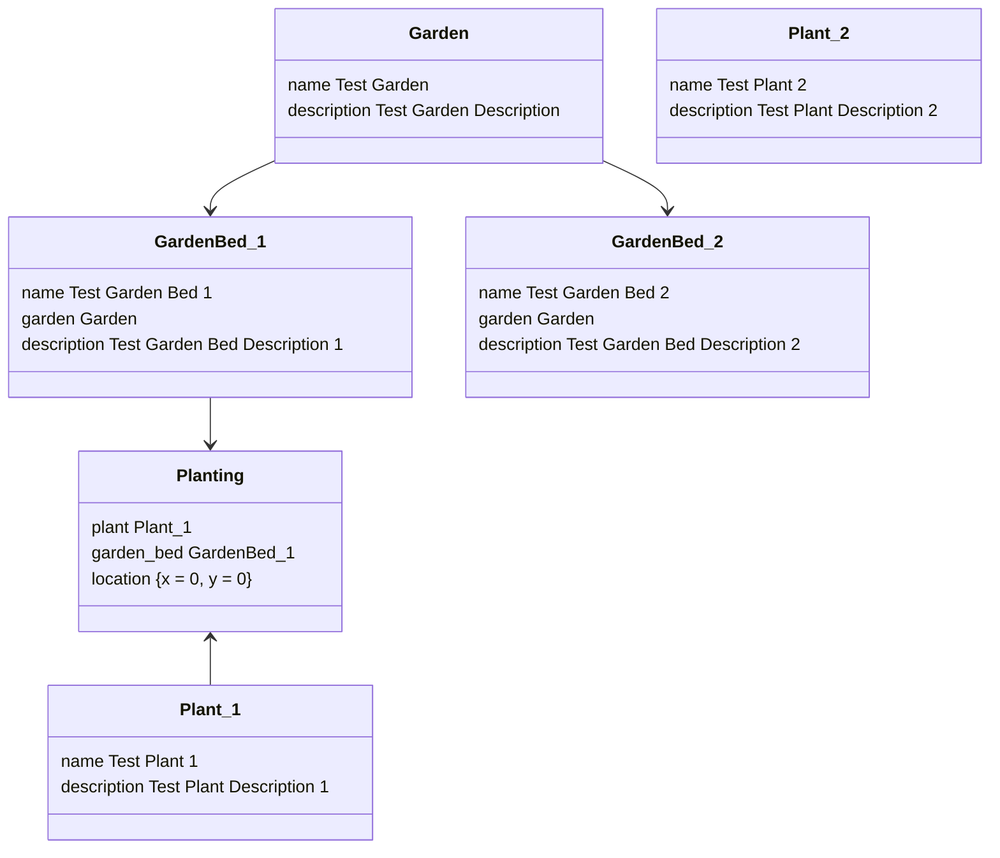

# Tests

## Test database data setup

```mermaid
classDiagram
    Garden : name Test Garden
    Garden : description Test Garden Description
    
    GardenBed_1 : name Test Garden Bed 1
    GardenBed_1 : garden Garden
    GardenBed_1 : description Test Garden Bed Description 1
    
    GardenBed_2 : name Test Garden Bed 2
    GardenBed_2 : garden Garden
    GardenBed_2 : description Test Garden Bed Description 2
    
    Plant_1 : name Test Plant 1
    Plant_1 : description Test Plant Description 1
    
    Plant_2 : name Test Plant 2
    Plant_2 : description Test Plant Description 2
    
    
    Garden --> GardenBed_1
    Garden --> GardenBed_2
    
    Planting : plant Plant_1
    Planting : garden_bed GardenBed_1
    Planting : location {x = 0, y = 0}
    
    GardenBed_1 --> Planting
    Planting <-- Plant_1
```